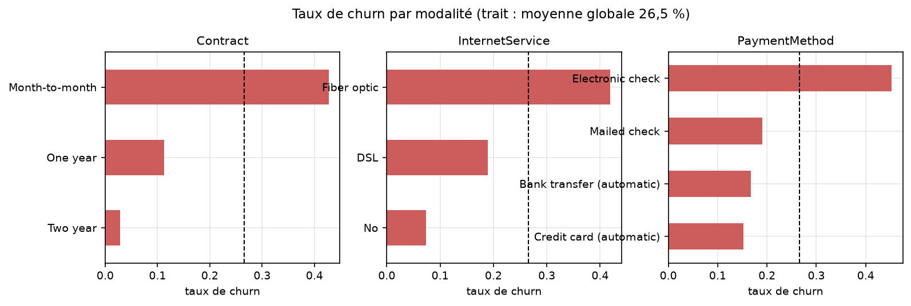
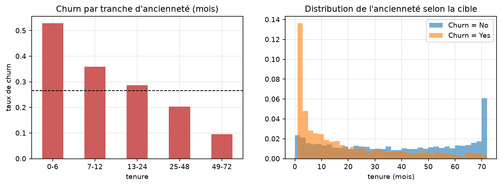
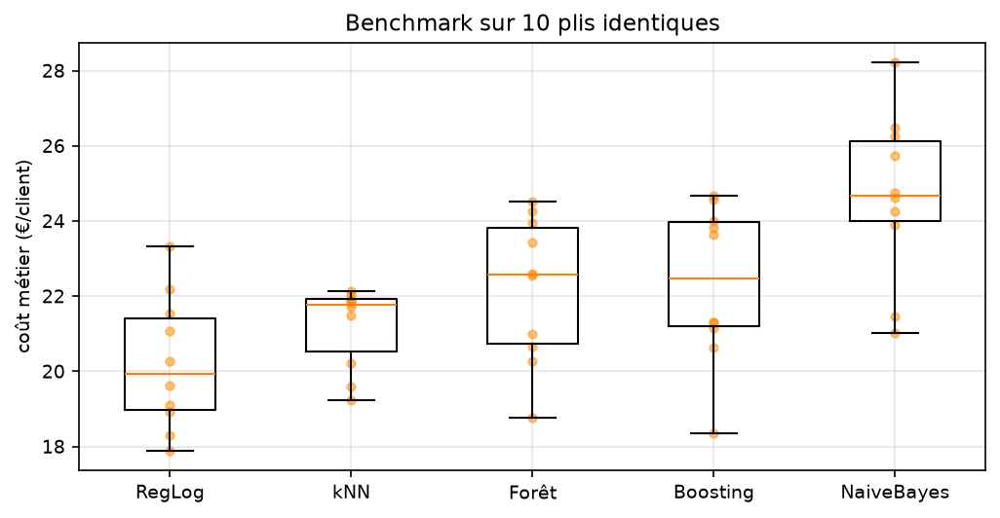
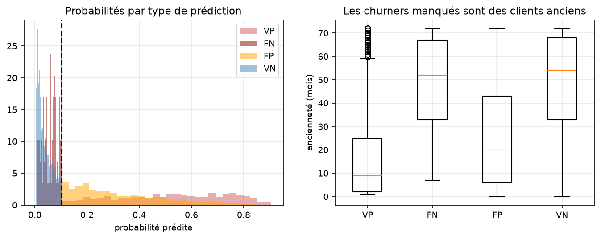
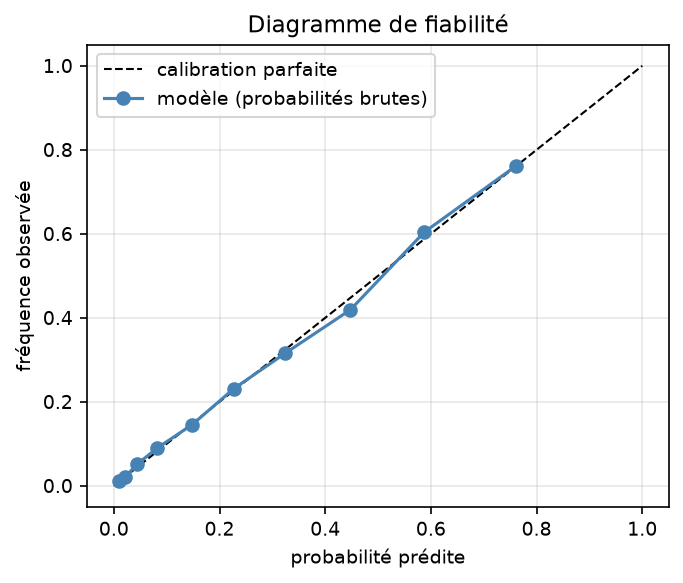
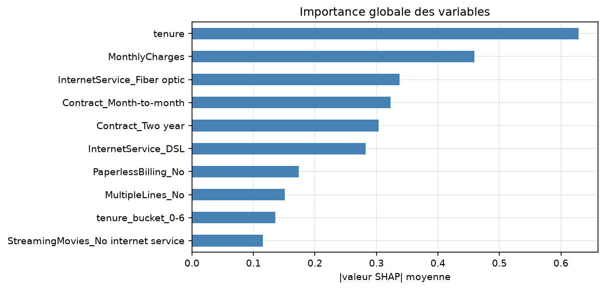
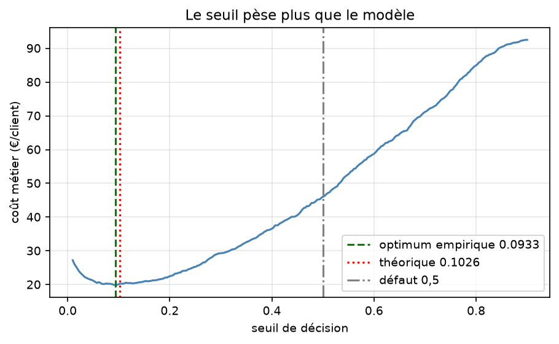

# Prédiction du churn client — de la donnée brute à l'API

**Projet final · Supervised Learning · Master IA**

---

## Synthèse

Un opérateur télécom veut cibler les clients susceptibles de résilier. Le
problème n'est pas de classer correctement : il est de décider sous **coûts
asymétriques**. Un client perdu coûte environ 350 €, une offre envoyée à tort
40 € — un rapport de neuf pour un.

Le système final ramène le coût du churn de **92,90 € à 19,89 € par client**
(−78,6 %) sur un jeu de test jamais utilisé pendant la modélisation. Il repose
sur une régression logistique, retenue au terme d'un benchmark de cinq familles
de modèles et de 80 essais d'optimisation qui n'ont produit aucun gain.

Trois résultats structurent ce rapport.

**Le seuil de décision compte plus que le modèle.** À probabilités identiques,
passer du seuil par défaut de 0,5 au seuil économique de 0,1026 fait tomber le
coût de 46,04 € à 20,22 €. Aucun raffinement de modélisation n'a approché ce
gain.

**Le modèle le plus simple a gagné.** La régression logistique devance forêt
aléatoire, gradient boosting, k-NN et Naive Bayes, et égale un boosting optimisé
par Optuna (écart de 0,02 €, 5 plis sur 10, p = 0,77).

**Les erreurs restantes ne sont pas corrigeables par le modèle.** Les churners
manqués sont des clients anciens et engagés dont la cause de départ est absente
des données. Le levier suivant n'est pas algorithmique : il est documentaire.

---

## 1. Cadrage (Mission 0)

Toutes les décisions ci-dessous ont été arrêtées **avant toute modélisation** et
n'ont pas été révisées ensuite.

### Problème métier

Identifier chaque mois les clients à risque de résiliation pour que le service
marketing leur adresse une offre de rétention. La sortie du modèle est une
**liste de ciblage**, pas une prédiction contemplative : c'est le coût de la
campagne, rapporté au chiffre d'affaires préservé, qui arbitre les choix
techniques.

### Coûts d'erreur

Ancrage tarifaire : abonnement moyen 64,76 €/mois, ancienneté médiane 29 mois,
55 % du parc en contrat mensuel.

| Erreur | Chiffrage | Coût |
|---|---|---|
| **Faux négatif** — un partant n'est pas ciblé | 64,76 € × 30 % de marge × 18 mois d'horizon | **350 €** |
| **Faux positif** — une offre part vers un client fidèle | 64,76 € × 20 % de remise × 3 mois + 2 € de contact | **40 €** |

Les deux hypothèses (horizon de 18 mois, marge de 30 %) sont explicites pour
pouvoir être discutées : faire varier l'horizon de 12 à 24 mois déplace le
rapport de 6:1 à 12:1 sans changer la conclusion qualitative.

### Métrique et seuils fixés a priori

**Métrique principale : le coût métier moyen par client**, `(350×FN + 40×FP)/n`,
à minimiser. C'est la seule qui encode le rapport de coûts. L'accuracy est
écartée — la baseline naïve atteint déjà 73,5 % — et le F1 aussi, qui pondère
précision et rappel à égalité en contradiction avec ce rapport. Métriques
secondaires : rappel et AUC-PR.

| Critère | Cible fixée | Référence |
|---|---|---|
| Coût métier | ≤ 65 €/client | Baseline naïve : 92,89 € |
| Rappel | ≥ 0,75 | |
| ROC-AUC | ≥ 0,82 | |

Le seuil optimal théorique se déduit directement de la matrice de coûts :
`C_FP / (C_FP + C_FN)` = 40/390 ≈ **0,10** — prédiction vérifiée en Mission 4.

### Risques

Stationnarité douteuse (concurrence, grille tarifaire), pas de contrainte de
latence (batch mensuel), base légale d'intérêt légitime au titre du RGPD, et
présence de deux attributs protégés — `gender` et `SeniorCitizen` — dont l'usage
est examiné en question 4.

---

## 2. Données et exploration (Mission 1)

7 043 clients, 21 colonnes, 26,54 % de churn. Trois découvertes ont orienté toute
la suite.

### `TotalCharges` : un piège de sens, pas de syntaxe

La colonne est typée en texte alors qu'elle devrait être numérique : elle
contient 11 chaînes vides, invisibles à `isna()`. Ces 11 lignes ont **toutes**
`tenure == 0` : ce sont des clients qui viennent de souscrire et n'ont pas encore
été facturés.

L'imputation par la médiane — réflexe par défaut, et celui que prescrit l'énoncé
pour le sous-pipeline numérique — leur attribuerait le cumul d'un client ancien
(≈ 1 400 €). L'imputation correcte est la **constante 0**. C'est un écart assumé
avec la consigne, justifié par le diagnostic : la médiane reste appliquée aux
autres colonnes numériques comme filet de sécurité en production.

### Les 22 « doublons » n'en sont pas

Aucun doublon strict. En revanche, 22 lignes deviennent identiques si l'on retire
`customerID`. Les supprimer serait une erreur : ce sont des clients distincts au
profil très commun (nouvel abonné fibre, contrat mensuel, chèque électronique).
Avec 19 variables majoritairement binaires, la collision de profils est
statistiquement attendue, et le segment concerné est justement le plus à risque.

### Aucune fuite dans les variables

L'AUC univariée maximale est de **0,740** (`tenure`), très loin d'un seuil de
suspicion. Aucune variable n'est connue seulement après le départ du client.
`customerID` est exclu — non par risque de fuite, mais parce qu'un identifiant
unique n'a aucun pouvoir de généralisation. Le vrai risque de fuite de ce projet
se situe dans le prétraitement, traité en Mission 2 et détaillé en question 5.

### Hypothèses vérifiées

Les cinq hypothèses sont validées, avec des écarts massifs : **42,7 % de churn en
contrat mensuel contre 2,8 % en engagement deux ans** (facteur 15) ; 52,9 % sur
les six premiers mois contre 9,5 % au-delà de quatre ans ; 41,9 % en fibre contre
19,0 % en DSL ; 45,3 % pour le chèque électronique contre 15-17 % en prélèvement
automatique ; et l'absence de services d'accompagnement triple le risque.

### Les trois insights majeurs

1. **L'engagement contractuel est le déterminant principal.** Et comme 55 % du
   parc est en mensuel, le segment le plus risqué est aussi le plus nombreux. Le
   levier métier le plus rentable est probablement une incitation à s'engager,
   pas une remise.
2. **Le risque est concentré sur les premiers mois, de façon non linéaire.** D'où
   la création d'une ancienneté catégorisée.
3. **Le prix perçu alimente le départ plus que le service.** Le client vulnérable
   type paie cher, n'a pas de services annexes et n'est retenu par aucun
   engagement.

Point de vigilance transmis : `gender` a une information mutuelle **nulle** avec
la cible. Son exclusion sert la performance et l'équité simultanément.

---

## 3. Pipeline et baseline (Mission 2)

### Pourquoi le split précède tout

Imputation, standardisation et encodage **apprennent des statistiques**. Les
ajuster sur l'ensemble complet ferait entrer de l'information du test dans le
train, et le score de test cesserait d'estimer la performance sur données
inconnues. Le découpage est stratifié (26,54 % de churn de part et d'autre), et
toutes les transformations vivent dans un `Pipeline` scikit-learn dont le `fit`
n'est appelé que sur le train.

### Baseline

| Configuration | Coût €/client | ROC-AUC |
|---|---|---|
| Baseline naïve (personne ne churne) | 92,87 | — |
| Pipeline + régression logistique | **20,60** | 0,846 |

La cible du cadrage (≤ 65 €) est dépassée dès la baseline. Ce n'est pas le signe
d'un problème facile, mais du poids du seuil.

### Le résultat le plus important du projet

| Seuil | Coût | Rappel | Clients ciblés |
|---|---|---|---|
| 0,50 (défaut) | 45,24 € | 0,546 | 22,1 % |
| **0,1026 (économique)** | **20,60 €** | **0,938** | 62,1 % |

Le même modèle, les mêmes probabilités : le coût est **divisé par plus de deux**
par le seul choix du seuil. Optimiser l'accuracy aurait conduit à un système deux
fois plus cher.

### Feature engineering : le rasoir d'Occam appliqué

Trois features issues des hypothèses de M1 ont été testées une par une sur les
mêmes plis, avec un test de Wilcoxon apparié.

| Configuration | Gain vs baseline | Plis améliorés | p |
|---|---|---|---|
| + `tenure_bucket` | +0,38 € | 3/5 | 0,312 |
| + `nb_services` | +0,03 € | 2/5 | 0,500 |
| + `price_drift` | +0,01 € | 1/5 | 1,000 |
| Les trois ensemble | +0,24 € | 3/5 | — |

**Aucun gain n'est significatif.** Et les trois ensemble font moins bien que
`tenure_bucket` seule — démonstration directe de ce que le rasoir cherche à
éviter. `tenure_bucket` est conservée sur un faisceau d'indices faible (trois
métriques améliorées, variance réduite), en l'assumant comme tel ; les deux
autres sont supprimées.

---

## 4. Benchmark et analyse d'erreurs (Mission 3)

### Une correction de protocole

L'énoncé autorise 5 ou 10 plis et demande une p-valeur inférieure à 0,05. Ces
deux exigences sont **incompatibles à 5 plis** : le test de Wilcoxon apparié sur
5 observations ne peut, même dans le cas le plus favorable, descendre sous
p = 0,0625. Le protocole retenu est donc à 10 plis, où le plancher tombe à 0,002.

### Résultats

| Modèle | Coût €/client | ROC-AUC | AUC-PR | Écart-type |
|---|---|---|---|---|
| **Régression logistique** | **20,22** | **0,848** | **0,667** | 1,68 |
| k-NN (k = 25) | 21,20 | 0,832 | 0,621 | **1,03** |
| Gradient boosting | 21,58 | 0,837 | 0,652 | 1,46 |
| Forêt aléatoire | 21,81 | 0,822 | 0,623 | 1,73 |
| Naive Bayes | 24,67 | 0,824 | 0,628 | 2,10 |

**Test statistique entre les deux meilleurs** : régression logistique contre
k-NN, écart de +0,99 €/client, 7 plis sur 10, **p = 0,131 — non significatif**.
On ne peut donc pas affirmer que la régression logistique est meilleure. Le choix
repose sur trois autres critères : les métriques indépendantes du seuil la
départagent plus nettement, l'explicabilité était une contrainte de cadrage, et
k-NN doit conserver les 5 634 points d'entraînement pour prédire.

Naive Bayes ferme la marche comme attendu : son hypothèse d'indépendance
conditionnelle est violée par la redondance `TotalCharges ≈ tenure ×
MonthlyCharges` (corrélation de 0,9996).

### Une prédiction démentie

L'hypothèse qu'un modèle à base d'arbres n'aurait aucun usage de `tenure_bucket`
— puisqu'il découpe `tenure` lui-même — s'est révélée **fausse pour la forêt
aléatoire**, qui y gagne près d'un euro par client. L'explication tient à
`max_features` : chaque nœud ne voit qu'un sous-ensemble aléatoire de variables,
donc fournir la découpe déjà faite augmente ses chances d'y avoir accès. La
feature n'ajoute pas d'information, elle en améliore l'**accessibilité**.

Une feature n'a donc pas de valeur en soi, mais relativement à la famille de
modèles qui la consomme. Feature engineering et choix du modèle ne sont pas deux
étapes indépendantes.

### Analyse d'erreurs

| | Faux négatifs | Vrais positifs |
|---|---|---|
| Contrat engagé | **77,2 %** | 7,0 % |
| Paiement automatique | **68,5 %** | 22,7 % |
| Ancienneté médiane | **52 mois** | 9 mois |

Le churner manqué est **l'exact opposé du churner type** : client ancien, engagé,
en prélèvement automatique, à facture modérée. Il présente tous les signaux de
fidélité et part quand même.

Le modèle ne peut pas le voir, et aucun réglage n'y changera rien : **la cause de
son départ n'est pas dans les données** — déménagement, offre concurrente,
incident de service. Les faux positifs sont son miroir exact (contrat mensuel,
fibre, ancienneté modérée) : sur les variables observables, ils sont
indiscernables des churners. Ce recouvrement est structurel — c'est le risque de
Bayes, le plancher qu'aucun algorithme ne franchit avec ces variables.

---

## 5. Optimisation, calibration, interprétabilité (Mission 4)

### Optuna : 80 essais pour établir qu'il n'y a rien à gagner

L'espace de recherche couvre la famille de modèles, ses hyperparamètres et les
trois drapeaux de features — 7 à 9 dimensions par essai. `MedianPruner` a élagué
20 essais sur 80, alimenté par un report du coût pli par pli.

| Configuration | Coût €/client | ROC-AUC | AUC-PR |
|---|---|---|---|
| Boosting — paramètres par défaut | 20,78 | 0,838 | 0,655 |
| Boosting — optimisé (80 essais) | 19,97 | 0,848 | 0,669 |
| **Régression logistique — non optimisée** | **19,95** | **0,849** | 0,668 |

**Le tuning améliore le boosting sans le prouver** : +0,81 €/client contre les
paramètres par défaut, mais p = 0,084, au-dessus du seuil de 5 %.

**Et le modèle optimisé n'égale que la régression logistique non optimisée** :
0,02 € d'écart, **5 plis gagnés sur 10**, p = 0,77. Égalité parfaite.

**Le score annoncé par Optuna était par ailleurs optimiste** : 19,72 € en
optimisation contre 19,97 € sur des plis indépendants. Cet écart de 0,25 € est du
**biais de sélection** — choisir le meilleur parmi 80 essais évalués sur les
mêmes plis, c'est du sur-apprentissage appliqué aux hyperparamètres. Seule une
réévaluation sur des plis frais le révèle.

L'analyse fANOVA montre que **le choix de la famille de modèles explique près de
73 % de la variance** des résultats, devant `tenure_bucket` (19 %). Les
hyperparamètres internes n'apparaissent pas. Choisir le bon type de modèle
importe quatre fois plus que le régler.

**Décision : le modèle final est la régression logistique non optimisée.** Elle
égale un boosting réglé par 80 essais, s'interprète directement et prédit
instantanément. À performance égale, le rasoir tranche.

### Calibration : rien à corriger

| Probabilités | Brier |
|---|---|
| **Brutes** | **0,13389** |
| Platt (sigmoid) | 0,13392 |
| Isotonique | 0,13415 |

Les deux méthodes de recalibration **dégradent** le score. L'écart moyen à la
diagonale est de 0,008. L'explication est théorique : la régression logistique
minimise la log-vraisemblance, une **règle de score propre**, dont l'optimum est
atteint lorsque les probabilités prédites égalent les probabilités
conditionnelles réelles. Elle est calibrée par construction.

Cela compte opérationnellement : le ciblage sous budget contraint repose sur un
**classement** par probabilité, qui n'est fiable que si les probabilités le sont.

### SHAP

Le classement recoupe l'information mutuelle de la Mission 1 — deux méthodes
indépendantes désignent les mêmes variables, ce qui est le meilleur signe
d'absence de comportement aberrant. `tenure` domine (0,629), devant
`MonthlyCharges` (0,459), la fibre et les modalités de contrat.

Trois modalités « No internet service » partagent exactement la même importance
(0,1155) : c'est la redondance des six colonnes de services, déjà repérée en
Mission 1, qui réapparaît dans le modèle ajusté.

Le *dependence plot* de `tenure` est une droite — le modèle étant linéaire et la
variable standardisée. C'est la limite anticipée en Mission 1, où les données
montraient une décroissance puis un plateau. `tenure_bucket` corrige
partiellement cette rigidité, ce qui explique qu'elle ait été la seule des trois
features à apporter un gain.

### Le seuil : la théorie confirmée

L'optimum empirique tombe à **0,0933**, contre 0,1026 prédit par le cadrage — un
écart de 0,009 pour un gain de 0,32 €. La formule `C_FP/(C_FP+C_FN)` donne
directement le bon ordre de grandeur. La courbe est très plate entre 0,08 et
0,15, donc le réglage fin importe peu : bonne nouvelle pour la robustesse en
production.

**C'est le seuil théorique qui est retenu**, plutôt que l'optimum empirique :
justifié *a priori* par la matrice de coûts et non ajusté sur les données, il est
plus robuste à la dérive.

### La contrainte de capacité

Le seuil optimal cible 62,8 % du parc — une campagne de masse, pas une liste de
priorité. Aucun service marketing ne dispose d'un tel budget.

| Capacité | Rappel | Précision | Coût €/client | vs naïve |
|---|---|---|---|---|
| Top 10 % | 0,288 | 0,762 | 67,11 | −28 % |
| **Top 20 %** | **0,515** | **0,683** | **47,57** | **−49 %** |
| Top 30 % | 0,673 | 0,595 | 35,23 | −62 % |
| Top 50 % | 0,879 | 0,466 | 21,92 | −76 % |

Même limité aux 20 % les plus à risque, le modèle réduit le coût de moitié avec
une précision de 0,68. Ce tableau constitue un livrable plus utile qu'un seuil
unique : il donne au métier l'arbitrage chiffré entre effort commercial et coût
du churn.

---

## 6. Industrialisation (Mission 5)

### Performances finales sur le jeu de test

Le jeu de test (1 409 clients) n'a servi à **aucune** décision de modélisation et
n'a été évalué qu'une fois.

| Métrique | Test | Validation croisée |
|---|---|---|
| **Coût métier** | **19,89 €/client** | 20,22 € |
| ROC-AUC | 0,845 | 0,848 |
| AUC-PR | 0,650 | 0,667 |
| Rappel | 0,941 | 0,938 |
| Précision | 0,409 | |
| Brier | 0,136 | 0,134 |

Matrice de confusion : VP 352 · FN 22 · FP 508 · VN 527.

L'écart entre test et validation croisée est **inférieur à la variance
inter-plis** : aucun sur-apprentissage. La baseline naïve coûtant 92,90 €, le
gain est de **−78,6 %**, très au-delà de la cible de 65 € fixée en Mission 0.

### Livrables

- **Sérialisation joblib** avec vérification que les prédictions après
  rechargement sont *strictement* identiques, et métadonnées versionnées (seuil,
  colonnes attendues, performances).
- **8 tests pytest** portant sur le modèle rechargé depuis le disque — donc sur
  l'objet que sert réellement l'API : forme de sortie, bornes des probabilités,
  gestion des valeurs manquantes, rejet d'une colonne absente, non-régression de
  la performance, déterminisme de la sérialisation, cohérence métier
  (l'engagement doit réduire le risque), et les trois endpoints.
- **API FastAPI** : `GET /health`, `POST /predict`, `GET /model-info`. La
  validation Pydantic rejette toute modalité inconnue par un code 422.
- **Model card** et **plan de monitoring** dans `reports/`.

Un piège technique mérite d'être signalé : joblib ne sérialise pas le code d'un
transformateur, seulement une **référence de module**. Un `FunctionTransformer`
pointant vers une fonction définie dans un notebook produit un modèle impossible
à recharger depuis l'API. C'est pourquoi tout le code du pipeline vit dans
`src/features.py`, et pourquoi l'entraînement se lance par `python -m src.train`
depuis la racine.

---

## 7. Questions de réflexion

### 7.1 Concept drift

Un modèle se dégrade en production sans que son code change, parce que le monde
qu'il décrit change. Trois mécanismes distincts.

Le **covariate shift** modifie la distribution des entrées : une campagne
d'acquisition agressive rajeunit le parc et déplace `tenure`. Le **concept
drift** au sens strict modifie la relation entre entrées et cible : une offre
concurrente rend le contrat mensuel plus risqué qu'avant, à profil identique. Le
**label shift** modifie le taux de base : le churn passe de 26 % à 35 % et le
seuil optimal se déplace.

Un quatrième mécanisme est propre à ce cas et souvent oublié : la **boucle de
rétroaction**. Les clients ciblés reçoivent une offre qui modifie leur
comportement. Le prochain jeu d'entraînement contiendra donc des clients dont le
non-départ résulte de l'intervention du modèle lui-même. Sans précaution, le
modèle apprendra que ce profil ne churne pas et cessera de l'alerter — il se
sabote en réussissant.

**Que surveiller.** Sans attendre la vérité terrain, disponible seulement après
plusieurs semaines : PSI et tests de Kolmogorov-Smirnov sur les variables
d'entrée, pondérés par leur importance SHAP — une dérive sur `tenure` est bien
plus grave qu'une dérive sur `PhoneService` ; et la dérive des prédictions
elles-mêmes (part du parc ciblée, référence 61 %, alerte à ±10 points). Une fois
la vérité terrain disponible : coût métier (référence 19,89 €, réentraînement
au-delà de 30 €), ROC-AUC, rappel et diagramme de fiabilité.

Un diagnostic utile : si le ROC-AUC reste stable pendant que le coût monte, le
problème est de **calibration ou de seuil**, pas de pouvoir discriminant — la
correction est un réajustement du seuil, bien moins coûteux qu'un
réentraînement.

**Le groupe témoin est non négociable.** Sans 5 à 10 % de clients au-dessus du
seuil volontairement non ciblés, le monitoring mesure un artefact et l'effet
causal de la campagne reste inconnu.

### 7.2 Information mutuelle contre corrélation de Pearson

La corrélation de Pearson mesure la force d'une relation **linéaire** entre deux
variables numériques. Elle vaut zéro pour toute dépendance non monotone : sur
`Y = X²` avec `X` centré, la corrélation est nulle alors que `X` détermine
entièrement `Y`.

L'information mutuelle mesure la réduction d'incertitude sur `Y` qu'apporte la
connaissance de `X` :

`I(X;Y) = H(Y) − H(Y|X)`

Elle est **nulle si et seulement si `X` et `Y` sont indépendantes** — une
équivalence, pas une implication à sens unique. Elle capte donc toute forme de
dépendance : non linéaire, non monotone, par paliers.

Trois avantages pratiques ont motivé son emploi ici. Elle s'applique
**directement aux variables catégorielles**, sans encodage préalable — décisif
quand 16 des 18 variables sont catégorielles, et qu'un encodage ordinal
arbitraire fausserait toute corrélation calculée dessus. Elle capte la relation
**non linéaire** de `tenure` avec le churn (décroissance forte puis plateau), que
Pearson sous-estimerait. Elle est enfin **invariante par transformation
bijective** : le résultat ne dépend pas de l'échelle choisie.

Son coût : elle ne dit rien du **sens** de la relation. `I(X;Y)` élevée signale
une dépendance forte sans indiquer si `X` augmente ou diminue le risque. C'est
pourquoi elle a été utilisée pour le classement (M1) et SHAP pour la direction
(M4) — les deux approches se complètent, et leur convergence sur les mêmes
variables constitue une validation croisée.

### 7.3 No Free Lunch

Le théorème de Wolpert établit que, **moyenné sur tous les problèmes
d'apprentissage possibles**, tous les algorithmes ont la même performance
attendue. Un algorithme ne peut être meilleur qu'un autre sur une classe de
problèmes qu'en étant moins bon sur une autre.

L'intuition : tout algorithme incorpore un **biais inductif** — une préférence a
priori pour certaines hypothèses. La régression logistique privilégie l'additif
dans l'espace des log-cotes ; les arbres privilégient les découpes
axiales ; k-NN suppose que la proximité géométrique implique la similarité de
classe. Aucun de ces biais n'est universellement correct : chacun aide quand la
structure réelle lui ressemble et nuit sinon.

**Ce projet en fournit une illustration expérimentale.** Sur des données
tabulaires, le gradient boosting est réputé dominant. Il arrive ici **troisième**,
derrière la régression logistique et k-NN. Après one-hot, la relation entre
variables et churn est proche de l'additif dans l'espace des log-cotes — terrain
de prédilection du modèle linéaire. Le biais inductif de la régression logistique
correspond à la structure du problème ; celui du boosting, plus flexible, n'a rien
de plus à exploiter et paie sa variance.

Cela **justifie directement le benchmark comparatif** : puisqu'aucun algorithme
n'est universellement supérieur, la seule façon de savoir lequel convient est de
les comparer empiriquement, sur les mêmes plis, avec un test statistique. La
réputation d'une famille de modèles n'est pas un argument.

Corollaire mesuré en Mission 4 : le choix de la famille explique 73 % de la
variance des résultats, contre une part négligeable pour les hyperparamètres
internes. **Le biais inductif compte plus que le réglage.**

### 7.4 Équité

Deux critères formels, incompatibles entre eux dès que les taux de base diffèrent.

**La parité démographique** exige que le taux de ciblage soit identique entre
groupes : `P(Ŷ=1 | A=a) = P(Ŷ=1 | A=b)`. Elle se mesure en comparant la part de
chaque sous-groupe classée positive.

**L'égalité des chances** (*equalized odds*) exige que les taux de vrais et de
faux positifs soient identiques **à cible égale** : `P(Ŷ=1 | Y=y, A=a) =
P(Ŷ=1 | Y=y, A=b)`. Elle se mesure en comparant rappel et taux de faux positifs
par sous-groupe.

Résultats sur le jeu de test :

| Sous-groupe | n | Churn réel | Part ciblée | Rappel | Précision | ROC-AUC |
|---|---|---|---|---|---|---|
| Femmes | 687 | 0,281 | 60,7 % | 0,938 | 0,434 | 0,839 |
| Hommes | 722 | 0,251 | 61,4 % | 0,945 | 0,386 | 0,852 |
| Non-senior | 1 187 | 0,233 | 56,7 % | 0,924 | 0,379 | 0,847 |
| **Senior** | 222 | 0,441 | **84,2 %** | 0,990 | 0,519 | 0,777 |
| Contrat 2 ans | 336 | 0,027 | 4,2 % | **0,000** | 0,000 | 0,740 |

**Le genre ne crée aucune disparité** : 60,7 % contre 61,4 % de ciblage, rappels
quasi identiques. Attendu, puisque `gender` a été exclu des features — son
information mutuelle avec la cible étant nulle, l'exclusion servait la
performance autant que l'équité. Cas favorable, et rare : l'arbitrage
performance/équité n'a pas eu lieu.

**L'âge crée une disparité forte.** Les seniors sont ciblés à 84,2 % contre
56,7 %, ratio de 1,49 : **la parité démographique n'est pas respectée**. Mais
sous l'égalité des chances, le modèle leur est **favorable** — rappel de 0,990
contre 0,924, précision de 0,519 contre 0,379. C'est l'illustration concrète de
l'incompatibilité des deux critères : leur taux de churn réel étant de 44 %
contre 23 %, satisfaire la parité démographique exigerait de **manquer
délibérément** des seniors sur le départ.

**Position retenue.** La disparité est acceptable dans cet usage précis, pour
trois raisons : elle reflète une différence réelle et non un biais fabriqué ;
l'égalité des chances est respectée, et même favorable au groupe protégé ; et la
conséquence du ciblage est de **recevoir une offre avantageuse**, non de subir un
refus. Une sur-représentation dans une population bénéficiaire n'a pas la portée
éthique d'une sur-représentation dans une population pénalisée.

Cette position est **conditionnelle et documentée** : elle deviendrait
inacceptable si le modèle était réutilisé pour une décision défavorable — d'où la
restriction d'usage explicite dans la model card. La performance discriminante
étant par ailleurs plus faible sur ce groupe (ROC-AUC 0,777 contre 0,847), un
suivi séparé est prévu.

**Un angle mort assumé** : le rappel est de **0,000** sur les contrats de deux
ans. Les 9 churners de ce segment sont tous manqués. Le modèle a appris que
l'engagement protège — vrai à 97,3 % — et n'alerte jamais. Ces départs sont rares
mais concernent des clients à forte valeur : une surveillance métier distincte
est recommandée, le modèle étant structurellement aveugle à ce cas.

### 7.5 Fuite de données

Six points d'entrée possibles, et comment chacun a été traité.

**1 — Imputation avant le split.** Calculer la médiane de `TotalCharges` sur les
7 043 lignes ferait entrer la distribution du test dans le train. *Traitement* :
`SimpleImputer` placé dans le `ColumnTransformer`, dont le `fit` n'est appelé que
sur le train. Pour `TotalCharges`, l'imputation retenue est de surcroît une
**constante** (0), donc sans statistique apprise.

**2 — Standardisation avant le split.** Même mécanisme : moyenne et écart-type
sont des statistiques du train. *Traitement* : `StandardScaler` dans le pipeline.

**3 — Encodage avant le split.** `OneHotEncoder` apprend la liste des modalités.
L'ajuster sur l'ensemble complet révélerait au train l'existence de modalités
propres au test. *Traitement* : encodeur dans le pipeline, avec
`handle_unknown="ignore"` pour qu'une modalité inconnue en production produise un
vecteur nul plutôt qu'une erreur.

**4 — SMOTE ou rééchantillonnage appliqué avant la validation croisée.** Générer
des exemples synthétiques sur l'ensemble du train, puis découper en plis, place
dans le pli de validation des points synthétisés à partir du pli
d'entraînement — fuite classique et particulièrement trompeuse, car elle gonfle
les scores sans lever d'erreur. *Traitement* : aucun rééchantillonnage n'a été
appliqué ; le déséquilibre est traité par le **seuil de décision**, qui n'apprend
rien des données.

**5 — Sélection de features sur l'ensemble complet.** Classer les variables par
information mutuelle sur les 7 043 lignes, puis ne garder que les meilleures,
utilise la cible du test pour décider de la structure du modèle. *Traitement* :
l'exploration de la Mission 1 est menée sur l'ensemble complet comme le prévoit
l'énoncé, mais **aucune sélection n'en découle**. Les décisions qui en sont issues
— les trois features candidates — ont été revalidées par validation croisée sur
le train seul, et deux des trois ont été supprimées à ce titre.

**6 — Réutilisation du jeu de test.** Évaluer sur le test, ajuster, réévaluer :
le test devient un second jeu de validation, et son score cesse d'être une
estimation honnête. C'est une fuite lente, par itérations. *Traitement* : le test
n'a été touché **qu'une seule fois**, dans `src/train.py`, après toutes les
décisions de modélisation.

**Une septième fuite, propre à ces données, n'existe pas ici mais méritait
vérification** : une variable connue seulement après le départ du client. La
vérification par AUC univariée plafonne à 0,740 — aucune variable ne prédit la
cible « trop parfaitement ».

**Vérification indirecte.** L'écart entre validation croisée (20,22 €) et test
(19,89 €) est inférieur à la variance inter-plis. Une fuite se manifesterait par
un score de validation nettement meilleur que le test — ce n'est pas le cas.

---

## 8. Conclusion

Le système atteint **19,89 €/client** contre 92,90 € pour la baseline naïve, soit
**−78,6 %**, avec un rappel de 0,941. La cible de 65 €/client fixée avant toute
modélisation est largement dépassée.

Le résultat le plus instructif du projet est négatif. Ni le feature engineering
(trois features testées, aucun gain significatif), ni le choix d'un modèle
sophistiqué (cinq familles comparées, la plus simple gagne), ni l'optimisation
d'hyperparamètres (80 essais, gain nul sur le modèle final), ni la calibration
(les deux méthodes dégradent) n'ont amélioré le système. **Le seul levier qui
comptait — le seuil de décision — était identifiable dès le cadrage, par une
division.**

Ce n'est pas un échec de la démarche : c'est ce que la démarche permet
d'établir. Sans le benchmark, on aurait déployé un boosting inutilement complexe.
Sans la réévaluation sur plis indépendants, on aurait cru l'optimisation utile.
Sans le test de Wilcoxon, on aurait pris du bruit pour un gain. La rigueur ne
sert pas seulement à trouver ce qui marche : elle sert à ne pas croire que
quelque chose marche.

Le levier suivant n'est pas algorithmique. Les 22 churners manqués sur le test
sont des clients anciens, engagés, en prélèvement automatique — dont la cause de
départ n'est enregistrée nulle part. Les détecter demanderait des données que
l'entreprise possède mais n'a pas versées au jeu : tickets support, incidents
réseau, évolution de la consommation. C'est la recommandation avec laquelle ce
rapport se clôt.

---

## Annexes

**Dépôt Git** — structure conforme : `api/`, `data/`, `model/`, `notebooks/`,
`reports/`, `scripts/`, `src/`, `tests/`, `README.md`, `.gitignore`,
`requirements.txt` à versions épinglées.

**Reproductibilité** — `random_state=42` fixé partout ; les quatre notebooks sont
ré-exécutables de bout en bout ; le jeu de données est reconstituable par
`python scripts/download_data.py`, avec vérification MD5.

**Notebooks** — `01_eda.ipynb` (exploration, détection de fuite),
`02_pipeline_baseline.ipynb` (pipeline, baseline, features),
`03_benchmark.ipynb` (cinq modèles, Wilcoxon, erreurs),
`04_optimisation_shap.ipynb` (Optuna, calibration, SHAP, seuil).

**Documents** — `reports/00_cadrage.md`, `reports/model_card.md`,
`reports/monitoring.md`.

**Sources** — Géron, *Hands-On Machine Learning* (O'Reilly) ; Mitchell et al.,
« Model Cards for Model Reporting » (FAccT 2019) ; Wolpert, « The Lack of A
Priori Distinctions Between Learning Algorithms » (1996) ; documentation
scikit-learn, Optuna, SHAP, FastAPI. Jeu de données : IBM Telco Customer Churn
Sample.